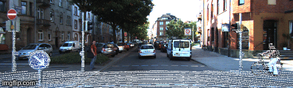

# KITTI Motion Compensation Library 

## Notes
* The namespace abbreviation "kmc" stands for "kitti motion compensation"
* This is an "east const" project, see [east vs west const](https://hackingcpp.com/cpp/design/east_vs_west_const.html)... get with the program -_-
* I use brace-initialization for almost everything so you won't see many equal signs :)

## Packages to Install 

    sudo apt install libgtest-dev libeigen3-dev libopencv-dev
    
## Kitti Benchmarks

| Mode | abs rel | sq rel | rmse | rmse log | a1 | a2 | a3 |
| :---:   | :---: | :---: | :---: | :---: | :---: | :---: | :---: |
| Raw | 0.092 | 0.730 | 4.392 | 0.171 | 0.907 | 0.964 | 0.982 |
| Motion Compensated | | | | | | | |
