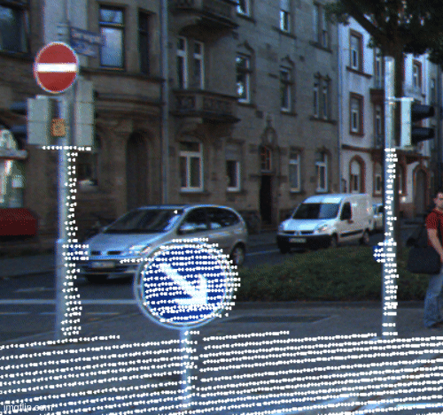
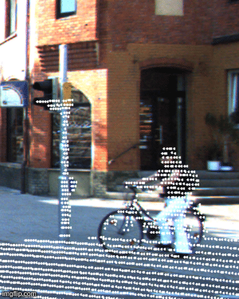
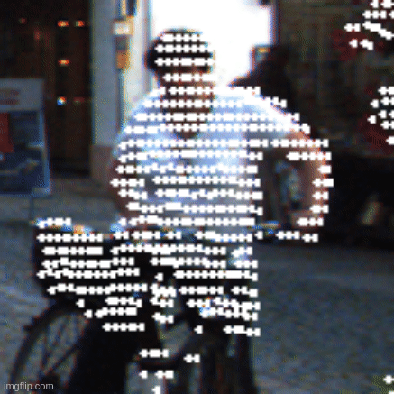

# KITTI Motion Compensation Library 
The KITTI lidar has a rolling shutter. Modeling and then correcting the distortion introduced by the rolling shutter effect is called "motion compensation". The KITTI Motion Compensation package provides an interface to motion compensate the KITTI dataset's Velodyne lidar pointcloud using vehicle odometry and timing. 

If you just want to know how to build, test, and run the package please jump to the [running the thing](#running-the-thing) section.

## What does the Rolling Shutter Distortion look like?
To visualize the rolling shutter effect, and how the motion compensation fixes the problem, is to project the pointcloud onto the image before and afer motion compensation. The poinclouds align much better after motion compensation than before motion compensation. The improvement is especially apparent for small objects, like road signs, bicycles, and people.  

"Wow... makes sense" | Look at that bike! |  The compensated person is much happier :)
:-------------------------:|:-------------------------:|:-------------------------:
 |   | 

Motion compensation only works for stationary objects. Moving objects cannot be motion compensated in the KITTI dataset. More modern post-KITTI 4D lidars that measure range rate (the speed of an object towards the sensor) can motion compensate moving objects, but we do not have that luxury here.

## Is the the first time somone thought about this?
Short answer, no. The authors of the KITTI dataset wrote in their original development kit readme:

    IMPORTANT NOTE: 
    Note that the velodyne scanner takes depth measurements
    continuously while rotating around its vertical axis (in contrast to the cameras,
    which are triggered at a certain point in time). This means that when computing
    point clouds you have to 'untwist' the points linearly with respect to the velo-
    dyne scanner location at the beginning and the end of the 360° sweep.

This part, "takes depth measurements continuously while rotating around its vertical axis" describes the lidar rolling shutter effect and this part, "you have to 'untwist' the points" describes the process of motion compensation. 

Provided that from day one the need for motion compensation was emphasized, one could imagine that there would be a pleathora of information about "untwisting" the pointclouds. This is not the case, and the commonly used KITTI "Raw Data" is not motion compensated beforehand.

### Why isn't the rolling shutter effect obvious?
Among the many good things the authors did, was the "hardware triggering" of the cameras from the rotating lidar. The KITTI vehicle was designed so that as the lidar scan sweeps the area in front of the vehicle, at the point the sweep is directly in front of the vehicle, the cameras are triggered.

The results of this, is that the rolling shutter effect for points directly in front of the car is small. Those lidar points right in front of the car, are captured roughly at the same time as the images and therefore the rolling shutter distortion is imperceptible.

However, as anyone who has ever worked with the KITTI dataset before knows, on the edge of the images the projection of the pointcloud onto the images is never perfect. Usually people attribute this to an incorrect calibration of the dataset or some other factor, ignore it and just take it for granted that the projection is not perfect. This is not the case.

The good design of the KITTI authors combined with the complexity of motion compensation, meant that this problem has largely been ignored by the research community. The KITTI Motion Compensation package is an answer to that unserviced technical debt. Taking advantage of information already readily available in the dataset to solve an important engineering problem.
    
## Demonstrated improvement on an algorithm benchmark
Monocular depth estimation, particularly self-supervised monocular depth estimation, is often benchmarked on the KITTI dataset. Where the ground truth depth, taken from the lidar, is compared to the predicted camera image depth made from a depth estimation network. 

If the lidar pointcloud does not project correctly onto the image then the performance of this benchmark will decrease. The correct projection is a function of the intrinsic calibration, extrinsic calibration, and the motion compensation. In the experiment below the calibrations are the same for both cases, meaning that any difference in performance is a function only of the motion compensation.

In the following experiment the popular depth estimation network ([Monodepth2](https://github.com/nianticlabs/monodepth2)) and its associated benchmark are run on the plain raw dataset and the motion compensated raw dataset. The benchmark improvement seen in the table below is not earth shattering, but getting a couple percentage points for free is pretty nice. 

| Mode | abs rel | sq rel | rmse | rmse log | a1 | a2 | a3 |
| :---:   | :---: | :---: | :---: | :---: | :---: | :---: | :---: |
| Raw                | 0.039038 | 0.049286 | 0.476586 | 0.066817 | 0.975427 | 0.992486 | 0.997693 |
| Motion Compensated | 0.038686 | 0.047515 | 0.469283 | 0.065809  | 0.975810 | 0.992780 | 0.997869 |
| Change (%)         | -0.91 | -3.73 | -1.56 | -1.53  | +0.04 | +0.03 | +0.02 |

Note that the metrics were calculated with a maximum of 10m, not 80m like the monodepth2 KITTI metrics are usually calculated. This was done because the effect of motion compensation is most pronounced in the near field area. 

Tested using the monodepth2 weights "mono+stereo_640x192" on 2011_09_26 runs 0001, 0005, 0091, 0104 and 0117. The scores in both cases are generally very good because the data was used for training the networks.

## Running the Thing 
Most users, if you have Docker, should just run the Docker based build. If you want to play around with it then you can do the local build too.

### Docker Build

#### Build the Images
    # build and run the tests just to make sure everything works as expected
    docker build . -t kmc --target build-and-run-tests

    # build the examples
     docker build . -t kmc --target build-examples

#### Launch a Container to Motion Compensate Runs
We need to mount your local dataset directory onto the container. In the following command please replace `<absolute_local_path>` with the absolute path to the place where you installed the `kitti_raw` dataset.

    # motion compensate all the runs found in `/kitti_raw/2011_09_26/`
    docker run -v /<absolute_local_path>/kitti_raw/:/kitti_raw/ kmc /kitti_raw/2011_09_26/

### Local Build
Install the following packages.

    sudo apt install libgtest-dev libeigen3-dev libopencv-dev

Run the following build commands.

    cmake -B build/ -DCMAKE_BUILD_TYPE=Release -DBUILD_TESTING=ON -DBUILD_EXAMPLES=ON
    cmake --build build/

Run the tests just to make sure everything works as expected.

    cd build && ctest --extra-verbose

#### Running the Example to Motion Compensate Runs

    # motion compensates all runs in given data directory
    ./motion_compensate_runs ../testing_assets/2011_09_26/

    # motion compensate specific runs in given data directory
    ./motion_compensate_runs ../testing_assets/2011_09_26/ 2011_09_26_drive_0005_sync

## Citations
* Geiger, Andreas et al. “Vision meets robotics: The KITTI dataset.” The International Journal of Robotics Research 32 (2013): 1231 - 1237.
* Godard, Clément et al. “Digging Into Self-Supervised Monocular Depth Estimation.” 2019 IEEE/CVF International Conference on Computer Vision (ICCV) (2018): 3827-3837.

## License
This work is released under the permissive MIT license. 

If you use the package in your research I kindly ask that you provide a footnote with a link to the library in your work.